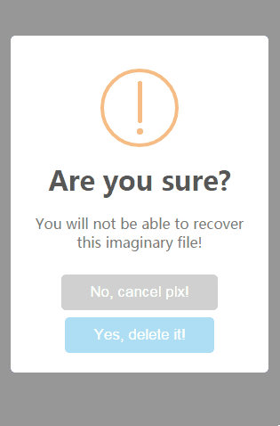

# popup

Popup your dialog

> Fork of [t4t5/sweetalert](https://github.com/t4t5/sweetalert)

Demo: <http://fritx.github.io/popup/demo>



## Features (vs sweetalert)

- More responsive, margins optimized
- Dialog and icon animation dropped
- SASS looks difficult to me, LESS instead
- Source code cut (748L to 106L), API cleared

## Usage

Popup a warn dialog:

```js
popup({
  icon: 'warn',
  title: 'Are you sure?',
  text: 'You will not be able to recover this imaginary file!',
  okBtn: 'Yes, delete it!',
  cancelBtn: 'No, cancel plx!'
}, function(ok){ /**/ })
```

For more details:

- [Popup demo source](demo/index.html)
- [t4t5/sweetalert](https://github.com/t4t5/sweetalert)
